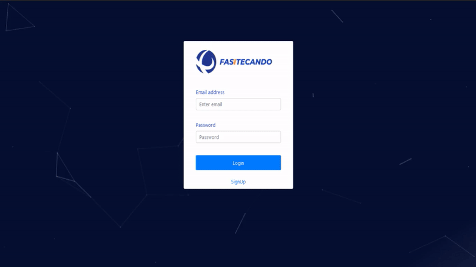
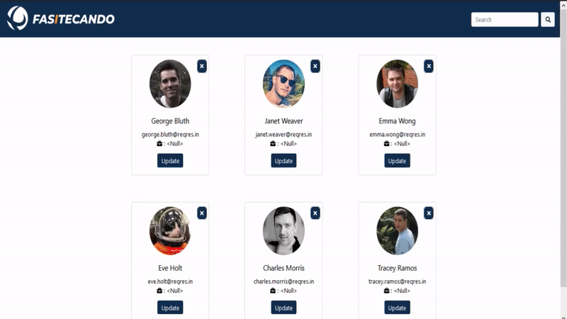

<h1 align="center">
    
    <br>Fasitecando<br/>
</h1>
<p align="center">
  
  
</p>


## 📸 Screenshots && Demo

- **Responsive**
<h1 align="center">
    
</h1>

- **Login and SignUp**
<h1 align="center">
    
</h1>

- **Update and Delete**
<h1 align="center">
    
</h1>

- **Pages and Search**
<h1 align="center">
    
</h1>


## 🚀 Techs
- **Frontend:**
    - [TypeScript](https://www.typescriptlang.org/)
    - [React](https://reactjs.org)
    - [Sass](https://sass-lang.com/)

    - I also used:
        - [Particles.js](https://www.npmjs.com/package/react-particles-js)
        - [Axios](https://www.npmjs.com/package/axios)
        - [FontAwesome](https://fontawesome.com/)
        - [React-Bootstrap](https://react-bootstrap.github.io/)

### How to install

> 1. Download or clone the Project-name repository

``` 
    git clone git@github.com:fsdavi/Fasitecando.git
```

> 2. Open the project in your preferred editor

> 3. In your terminal, install the necessary packages:

``` 
    yarn
```
or
``` 
    npm install
```

> 4. Great! Now you can go to the name-project folder and start the server:
``` 
    cd name-project

    yarn start
```
or
``` 
    npm start
```

---
> 5. Open your browser! The name-project will be available at http://localhost:3000/


---

## What come next
- **On Frontend:**
    - Going to work more on design for a better UX, the figma project is comming;
    - Build a API Rest with Node.js and MongoDB;
    - The model remaains MVC.

<div align="center">
<h3 align="center">Author</h3>
<br />
<p align="center">
<a href="https://www.linkedin.com/in/davisfreire/" target="_blank">Davi :space_invader:</a>
</p>

<p align="center">
    <span>
        <a href="https://github.com/fsdavi" target="_blank">Github</a>
    </span>
    |
    <span>
        <a href="https://medium.com/@fsdavi.dev" target="_blank">Medium</a>
    </span>
    :heart:
</p>
</div>

